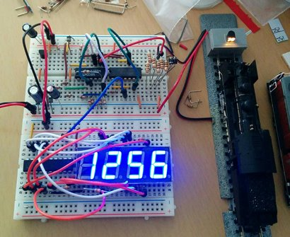
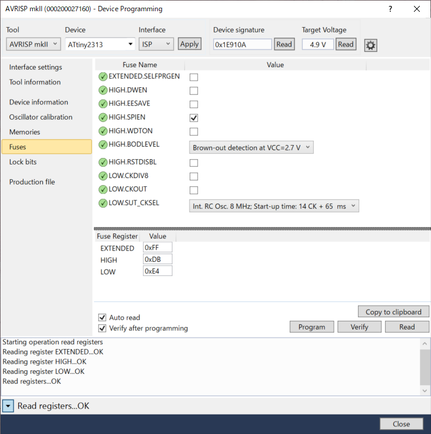

# Railcom Train Address Display Unit Firmware for ATtiny2313

NMRA Standard 9.3.2で規定されている、Railcomパケットを受け取り、車両のアドレスを7セグLEDに表示する制御マイコンのファームウェアです。

Atmel ATtiny2313で動作確認を行っておりますが、ATtiny2313A / ATtiny4313でも動作するものと思われます。

## 主要機能

  * Railcom Packetのうち、Channel 1のID1 / ID2のみを解釈可能 (車両アドレスの上位ビット・下位ビット)
  * Railcom Packetは、パケットデコード回路から250kbps UARTで受信
  * 4桁タイプのアノードコモン7セグメントLEDをダイナミック点灯で制御
  * アドレス1からアドレス9999までを表示可能
  
## 動作確認に使用したコマンドステーション・デコーダー
  * Roco Z21
  * Lenz SILVERmini+
  
## 対応する回路図・基板設計データ

準備中です。

## AVR Fuse Bitの設定内容

8MHz内臓オシレータで、8MHz動作するようにするために下記の内容を書きます。
 (表記はAtmel Studioのものとなります)

  * EXTENDED: 0xFF
  * HIGH: 0xDB
  * LOW: 0xE4

ただし、特にEEPROM等を用いていないため、買ってきた状態のATtiny2313であればCKDIV8のチェックを外すだけで正常動作するはずです。

